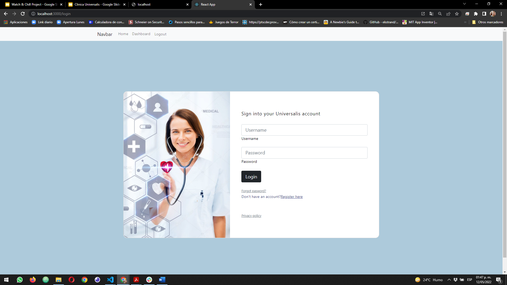

#  👓 Clinica Universalis App for medical records.

## 📄 Description

This is a Health Proffesional App call "Clinical Universalis" for registering patient medical records. It was made with React and MERN technologies. You can Create, Read, Update and Delete patient information.

## ⚙⚙ Web Page Functionality

The following image shows the Clinica Universalis application's appearance:

You can get in into the App in the next link [Clinica Universalis App](https://marcogonzalezguzman77.github.io/reactPortfolio/) for testing.
